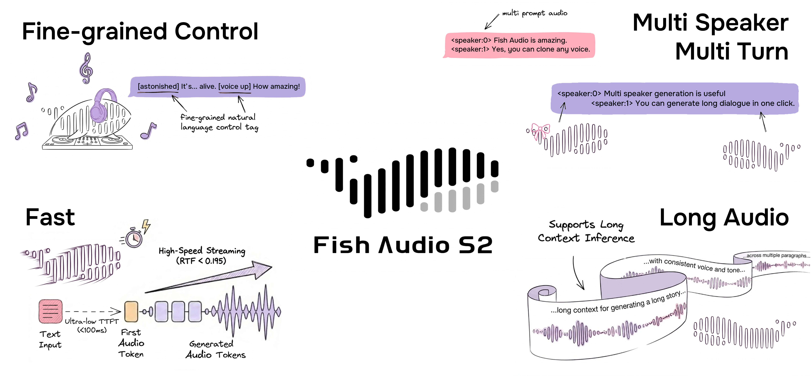
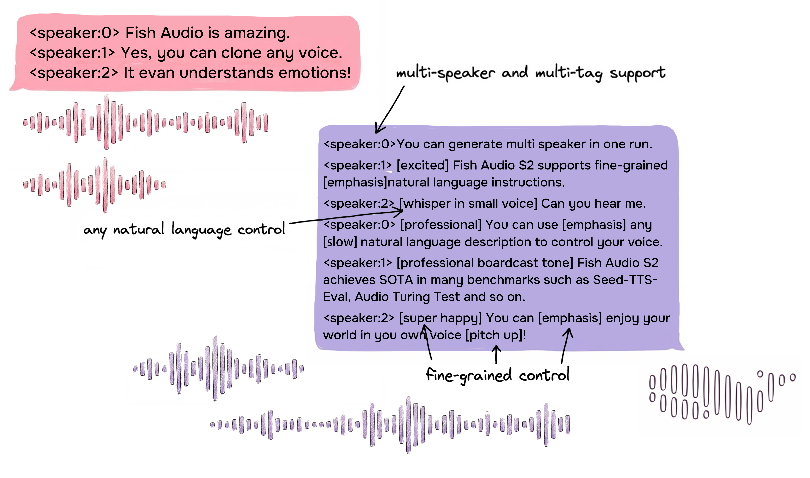

<div align="center">
<h1>Fish Speech</h1>

[English](../README.md) | [简体中文](README.zh.md) | **Portuguese** | [日本語](README.ja.md) | [한국어](README.ko.md) | [العربية](README.ar.md) | [Español](docs/README.es.md)  <br>

<a href="https://www.producthunt.com/products/fish-speech?embed=true&utm_source=badge-top-post-badge&utm_medium=badge&utm_source=badge-fish&#0045;audio&#0045;s1" target="_blank"></a>
<a href="https://trendshift.io/repositories/7014" target="_blank">
    
</a>
<br>
</div>
<br>

<div align="center">
    <br>
</div>

<br>

<div align="center">
    <a target="_blank" href="https://discord.gg/Es5qTB9BcN">
        
    </a>
    <a target="_blank" href="https://hub.docker.com/r/fishaudio/fish-speech">
        
    </a>
    <a target="_blank" href="https://pd.qq.com/s/bwxia254o">
      
    </a>
</div>

<div align="center">
    <a target="_blank" href="https://huggingface.co/fishaudio/s2-pro">
        
    </a>
    <a target="_blank" href="https://fish.audio/blog/fish-audio-open-sources-s2/">
        
    </a>
    <a target="_blank" href="https://arxiv.org/abs/2603.08823">
        
    </a>
</div>

> [!IMPORTANT]
> **Aviso de Licença**
> Este repositório de código e seus pesos de modelo associados são lançados sob a **[FISH AUDIO RESEARCH LICENSE](../LICENSE)**. Consulte [LICENSE](../LICENSE) para obter mais detalhes.


> [!WARNING]
> **Aviso Legal**
> Não nos responsabilizamos por qualquer uso ilegal deste repositório. Consulte as leis locais sobre DMCA e outras regulamentações relevantes.

## Início Rápido

### Links da Documentação

Esta é a documentação oficial do Fish Audio S2, siga as instruções para começar facilmente.

- [Instalação](https://speech.fish.audio/install/)
- [Inferência por Linha de Comando](https://speech.fish.audio/inference/)
- [Inferência por WebUI](https://speech.fish.audio/inference/)
- [Inferência por Servidor](https://speech.fish.audio/server/)
- [Implantação Docker](https://speech.fish.audio/install/)

> [!IMPORTANT]
> **Caso deseje utilizar o SGLang Server, consulte o [SGLang-Omni README](https://github.com/sgl-project/sglang-omni/blob/main/sglang_omni/models/fishaudio_s2_pro/README.md).**
>
> **Caso deseje utilizar o vLLM Omni Server, consulte o [vLLM-Omni Fish Speech README](https://github.com/vllm-project/vllm-omni/blob/main/examples/online_serving/fish_speech/README.md).**

### Guia para Agentes de LLM

```
Leia primeiro https://speech.fish.audio/install/ e siga a documentação para instalar e configurar o Fish Audio S2.
```

## Fish Audio S2 Pro
**O sistema de conversão de texto em fala (TTS) multilíngue líder do setor, redefinindo as fronteiras da geração de voz.**

Fish Audio S2 Pro é o modelo multimodal mais avançado desenvolvido pela [Fish Audio](https://fish.audio/). Treinado em mais de **10 milhões de horas** de dados de áudio massivos, cobrindo mais de **80 idiomas** globais. Através de uma arquitetura inovadora de **Dual-Autoregressive (Dual-AR)** e tecnologia de alinhamento por aprendizado por reforço (RL), o S2 Pro é capaz de gerar fala com um senso de naturalidade, realismo e riqueza emocional extremos, liderando tanto em competições de código aberto quanto proprietário.

O grande diferencial do S2 Pro reside em seu suporte para controle inline de granularidade ultra-fina de prosódia e emoção ao nível de **sub-palavra (Sub-word Level)** via tags de linguagem natural (como `[whisper]`, `[excited]`, `[angry]`), além de suporte nativo para múltiplos falantes e geração de diálogos de múltiplos turnos com contexto ultra-longo.

Visite agora o [site oficial da Fish Audio](https://fish.audio/) para experimentar a demonstração online, ou leia nosso [relatório técnico](https://arxiv.org/abs/2603.08823) e [artigo no blog](https://fish.audio/blog/fish-audio-open-sources-s2/) para saber mais.

### Variantes de Modelo

| Modelo | Tamanho | Disponibilidade | Descrição |
|------|------|-------------|-------------|
| S2-Pro | 4B parâmetros | [HuggingFace](https://huggingface.co/fishaudio/s2-pro) | Modelo flagship completo, com máxima qualidade e estabilidade |

Para mais detalhes sobre os modelos, consulte o [relatório técnico](https://arxiv.org/abs/2411.01156).

## Resultados de Benchmark

| Benchmark | Fish Audio S2 |
|------|------|
| Seed-TTS Eval — WER (Chinês) | **0.54%** (Melhor geral) |
| Seed-TTS Eval — WER (Inglês) | **0.99%** (Melhor geral) |
| Audio Turing Test (Com instrução) | **0.515** Média posterior |
| EmergentTTS-Eval — Taxa de Vitória | **81.88%** (Maior geral) |
| Fish Instruction Benchmark — TAR | **93.3%** |
| Fish Instruction Benchmark — Qualidade | **4.51 / 5.0** |
| Multilíngue (MiniMax Testset) — Melhor WER | **11 de 24** idiomas |
| Multilíngue (MiniMax Testset) — Melhor SIM | **17 de 24** idiomas |

No Seed-TTS Eval, o S2 alcançou o menor WER entre todos os modelos avaliados (incluindo sistemas proprietários): Qwen3-TTS (0.77/1.24), MiniMax Speech-02 (0.99/1.90), Seed-TTS (1.12/2.25). No Audio Turing Test, o valor de 0.515 do S2 representa um aumento de 24% em relação ao Seed-TTS (0.417) e 33% em relação ao MiniMax-Speech (0.387). No EmergentTTS-Eval, o S2 destacou-se especialmente em dimensões como paralinguística (taxa de vitória de 91.61%), frases interrogativas (84.41%) e complexidade sintática (83.39%).

## Destaques



### Controle Inline de Granularidade Ultra-Fina via Linguagem Natural

S2 Pro confere à voz uma "espiritualidade" sem precedentes. Através de uma sintaxe simples de `[tag]`, você pode inserir instruções emocionais precisamente em qualquer posição do texto.
- **Suporte para mais de 15.000 tags únicas**: Não limitado a predefinições fixas, suporta **descrições textuais de formato livre**. Você pode tentar `[whisper in small voice]` (sussurrando), `[professional broadcast tone]` (tom de locução profissional) ou `[pitch up]` (aumentar o tom).
- **Rica biblioteca de emoções**:
  `[pause]` `[emphasis]` `[laughing]` `[inhale]` `[chuckle]` `[tsk]` `[singing]` `[excited]` `[laughing tone]` `[interrupting]` `[chuckling]` `[excited tone]` `[volume up]` `[echo]` `[angry]` `[low volume]` `[sigh]` `[low voice]` `[whisper]` `[screaming]` `[shouting]` `[loud]` `[surprised]` `[short pause]` `[exhale]` `[delight]` `[panting]` `[audience laughter]` `[with strong accent]` `[volume down]` `[clearing throat]` `[sad]` `[moaning]` `[shocked]`

### Arquitetura Inovadora Dual-Autoregressive (Dual-AR)

S2 Pro adota uma arquitetura Dual-AR mestre-escravo, consistindo de um Decoder-only Transformer e um codec de áudio RVQ (10 codebooks, cerca de 21 Hz de taxa de frames):

- **Slow AR (4B parâmetros)**: Atua ao longo do eixo temporal, prevendo o codebook semântico central.
- **Fast AR (400M parâmetros)**: Gera os 9 codebooks residuais restantes em cada passo de tempo, restaurando detalhes acústicos extremos com delicadeza.

Este design assimétrico garante fidelidade extrema ao áudio enquanto aumenta significativamente a velocidade de inferência.

### Alinhamento por Aprendizado por Reforço (RL Alignment)

S2 Pro utiliza a tecnologia **Group Relative Policy Optimization (GRPO)** para o alinhamento pós-treinamento. Utilizamos o mesmo conjunto de modelos para limpeza e anotação de dados diretamente como modelos de recompensa (Reward Model), resolvendo perfeitamente o problema de descasamento entre a distribuição dos dados de pré-treinamento e os objetivos de pós-treinamento.
- **Sinais de recompensa multidimensionais**: Avalia de forma abrangente a precisão semântica, a capacidade de seguir instruções, a pontuação de preferência acústica e a similaridade de timbre, garantindo que cada segundo de fala gerada esteja alinhado com a intuição humana.

### Desempenho de Inferência de Streaming Extremo (Baseado em SGLang)

Como a arquitetura Dual-AR é estruturalmente isomorfa à estrutura padrão de LLMs, o S2 Pro suporta nativamente todos os recursos de aceleração de inferência do SGLang, incluindo loteamento contínuo (Continuous Batching), Paged KV Cache, CUDA Graph e cache de prefixo baseado em RadixAttention.

**Desempenho em uma única GPU NVIDIA H200:**
- **Fator em Tempo Real (RTF)**: 0.195
- **Latência do Primeiro Áudio (TTFA)**: aprox. 100 ms
- **Taxa de Transferência Ultrarrápida**: Alcance de 3.000+ acoustic tokens/s mantendo RTF < 0.5

### Poderoso Suporte Multilíngue

S2 Pro suporta mais de 80 idiomas, possibilitando síntese de alta qualidade sem a necessidade de fonemas ou processamento específico por idioma:

- **Tier 1**: Japonês (ja), Inglês (en), Chinês (zh)
- **Tier 2**: Coreano (ko), Espanhol (es), Português (pt), Árabe (ar), Russo (ru), Francês (fr), Alemão (de)
- **Cobertura Global**: sv, it, tr, no, nl, cy, eu, ca, da, gl, ta, hu, fi, pl, et, hi, la, ur, th, vi, jw, bn, yo, xsl, cs, sw, nn, he, ms, uk, id, kk, bg, lv, my, tl, sk, ne, fa, af, el, bo, hr, ro, sn, mi, yi, am, be, km, is, az, sd, br, sq, ps, mn, ht, ml, sr, sa, te, ka, bs, pa, lt, kn, si, hy, mr, as, gu, fo, etc.

### Geração Nativa Multi-falante



O Fish Audio S2 permite que os usuários enviem áudio de referência contendo múltiplos falantes, e o modelo processará as características de cada falante via o token `<|speaker:i|>`. Em seguida, você pode controlar o desempenho do modelo através do token de ID do falante, permitindo incluir múltiplos falantes em uma única geração. Não é mais necessário enviar áudios de referência separadamente para cada falante.

### Geração de Diálogos Multiturnos

Graças à expansão do contexto do modelo, nosso modelo agora pode aproveitar as informações prévias para aumentar a expressividade dos conteúdos gerados subsequentemente, elevando assim a naturalidade dos diálogos.

### Clonagem de Voz Rápida

O Fish Audio S2 suporta clonagem de voz precisa usando curtas amostras de referência (normalmente 10-30 segundos). O modelo captura o timbre, o estilo de fala e as tendências emocionais, gerando vozes clonadas realistas e consistentes sem necessidade de ajustes finos adicionais.
Caso deseje utilizar o SGLang Server, consulte o [SGLang-Omni README](https://github.com/sgl-project/sglang-omni/blob/main/sglang_omni/models/fishaudio_s2_pro/README.md).

---

## Agradecimentos

- [VITS2 (daniilrobnikov)](https://github.com/daniilrobnikov/vits2)
- [Bert-VITS2](https://github.com/fishaudio/Bert-VITS2)
- [GPT VITS](https://github.com/innnky/gpt-vits)
- [MQTTS](https://github.com/b04901014/MQTTS)
- [GPT Fast](https://github.com/pytorch-labs/gpt-fast)
- [GPT-SoVITS](https://github.com/RVC-Boss/GPT-SoVITS)
- [Qwen3](https://github.com/QwenLM/Qwen3)

## Relatório Técnico

```bibtex
@misc{fish-speech-v1.4,
      title={Fish-Speech: Leveraging Large Language Models for Advanced Multilingual Text-to-Speech Synthesis},
      author={Shijia Liao and Yuxuan Wang and Tianyu Li and Yifan Cheng and Ruoyi Zhang and Rongzhi Zhou and Yijin Xing},
      year={2024},
      eprint={2411.01156},
      archivePrefix={arXiv},
      primaryClass={cs.SD},
      url={https://arxiv.org/abs/2411.01156},
}

@misc{liao2026fishaudios2technical,
      title={Fish Audio S2 Technical Report}, 
      author={Shijia Liao and Yuxuan Wang racing Songting Liu and Yifan Cheng and Ruoyi Zhang and Tianyu Li and Shidong Li and Yisheng Zheng and Xingwei Liu and Qingzheng Wang and Zhizhuo Zhou and Jiahua Liu and Xin Chen and Dawei Han},
      year={2026},
      eprint={2603.08823},
      archivePrefix={arXiv},
      primaryClass={cs.SD},
      url={https://arxiv.org/abs/2603.08823}, 
}
```
