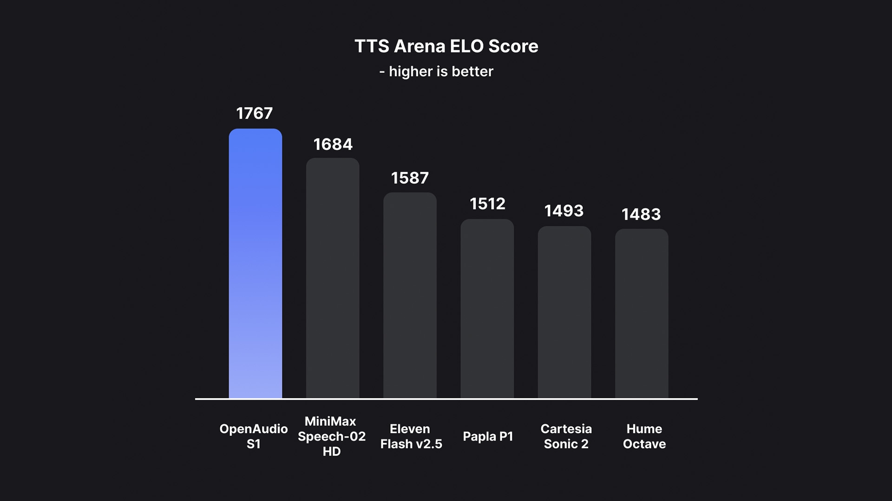

# OpenAudio (سابقاً Fish-Speech)

<div align="center">

<div align="center">


</div>

<strong>سلسلة نماذج تحويل النص إلى كلام المتقدمة</strong>

<div>
<a target="_blank" href="https://discord.gg/Es5qTB9BcN">

</a>
<a target="_blank" href="http://qm.qq.com/cgi-bin/qm/qr?_wv=1027&k=jCKlUP7QgSm9kh95UlBoYv6s1I-Apl1M&authKey=xI5ttVAp3do68IpEYEalwXSYZFdfxZSkah%2BctF5FIMyN2NqAa003vFtLqJyAVRfF&noverify=0&group_code=593946093">

</a>
<a target="_blank" href="https://hub.docker.com/r/fishaudio/fish-speech">

</a>
</div>

<strong>جربه الآن:</strong> <a href="https://fish.audio">Fish Audio Playground</a> | <strong>تعلم المزيد:</strong> <a href="https://openaudio.com">موقع OpenAudio</a>

</div>·

---

!!! note "إشعار الترخيص"
    يتم إصدار قاعدة الكود هذه تحت **رخصة Apache** ويتم إصدار جميع أوزان النماذج تحت **رخصة CC-BY-NC-SA-4.0**. يرجى الرجوع إلى [رخصة الكود](https://github.com/fishaudio/fish-speech/blob/main/LICENSE) و [رخصة النموذج](https://spdx.org/licenses/CC-BY-NC-SA-4.0) لمزيد من التفاصيل.

!!! warning "إخلاء المسؤولية القانونية"
    نحن لا نتحمل أي مسؤولية عن أي استخدام غير قانوني لقاعدة الكود. يرجى الرجوع إلى القوانين المحلية حول DMCA والقوانين الأخرى ذات الصلة.

## **المقدمة**

نحن متحمسون للإعلان عن إعادة تسمية علامتنا التجارية إلى **OpenAudio** - تقديم سلسلة جديدة من نماذج تحويل النص إلى كلام المتقدمة التي تبني على أساس Fish-Speech مع تحسينات كبيرة وقدرات جديدة.

**Openaudio-S1-mini**: [المدونة](https://openaudio.com/blogs/s1); [الفيديو](https://www.youtube.com/watch?v=SYuPvd7m06A); [Hugging Face](https://huggingface.co/fishaudio/openaudio-s1-mini);

**Fish-Speech v1.5**: [الفيديو](https://www.bilibili.com/video/BV1EKiDYBE4o/); [Hugging Face](https://huggingface.co/fishaudio/fish-speech-1.5);

## **النقاط البارزة**

### **جودة TTS ممتازة**

نستخدم مقاييس تقييم Seed TTS لتقييم أداء النموذج، وتظهر النتائج أن OpenAudio S1 يحقق **0.008 WER** و **0.004 CER** على النص الإنجليزي، وهو أفضل بكثير من النماذج السابقة. (الإنجليزية، التقييم التلقائي، بناءً على OpenAI gpt-4o-transcribe، مسافة المتحدث باستخدام Revai/pyannote-wespeaker-voxceleb-resnet34-LM)

| النموذج | معدل خطأ الكلمات (WER) | معدل خطأ الأحرف (CER) | مسافة المتحدث |
|:-----:|:--------------------:|:-------------------------:|:----------------:|
| **S1** | **0.008** | **0.004** | **0.332** |
| **S1-mini** | **0.011** | **0.005** | **0.380** |

### **أفضل نموذج في TTS-Arena2**

حقق OpenAudio S1 **المرتبة الأولى** في [TTS-Arena2](https://arena.speechcolab.org/)، المعيار لتقييم تحويل النص إلى كلام:

<div align="center">
    
</div>

### **التحكم في الكلام**
يدعم OpenAudio S1 **مجموعة متنوعة من العلامات العاطفية والنبرة والخاصة** لتعزيز تركيب الكلام:

- **المشاعر الأساسية**:
```
(غاضب) (حزين) (متحمس) (مندهش) (راضي) (مسرور) 
(خائف) (قلق) (منزعج) (عصبي) (محبط) (مكتئب)
(متعاطف) (محرج) (مشمئز) (متأثر) (فخور) (مسترخي)
(ممتن) (واثق) (مهتم) (فضولي) (مرتبك) (مبتهج)
```

- **المشاعر المتقدمة**:
```
(محتقر) (غير سعيد) (قلق) (هستيري) (غير مبال) 
(نافد الصبر) (مذنب) (ازدرائي) (مذعور) (غاضب) (مترد)
(متحمس) (غير موافق) (سلبي) (منكر) (مندهش) (جدي)
(ساخر) (مصالح) (مواسي) (صادق) (ساخر)
(متردد) (مستسلم) (مؤلم) (محرج) (مسلي)
```

(الدعم للإنجليزية والصينية واليابانية الآن، والمزيد من اللغات قادم قريبًا!)

- **علامات النبرة**:
```
(بنبرة مستعجلة) (صراخ) (صراخ) (همس) (نبرة ناعمة)
```

- **تأثيرات صوتية خاصة**:
```
(ضحك) (قهقهة) (نشيج) (بكاء بصوت عالٍ) (تنهد) (لهاث)
(أنين) (ضحك الجمهور) (ضحك الخلفية) (ضحك الجمهور)
```

يمكنك أيضًا استخدام ها،ها،ها للتحكم، هناك العديد من الحالات الأخرى في انتظار استكشافك بنفسك.

### **نوعان من النماذج**

نقدم متغيرين من النماذج لتناسب الاحتياجات المختلفة:

- **OpenAudio S1 (4 مليار معامل)**: نموذجنا الرئيسي كامل الميزات المتاح على [fish.audio](https://fish.audio)، يقدم أعلى جودة لتركيب الكلام مع جميع الميزات المتقدمة.

- **OpenAudio S1-mini (0.5 مليار معامل)**: إصدار مقطر بالقدرات الأساسية، متاح على [Hugging Face Space](https://huggingface.co/spaces/fishaudio/openaudio-s1-mini)، محسن للاستنتاج الأسرع مع الحفاظ على الجودة الممتازة.

كل من S1 و S1-mini يدمجان التعلم المعزز عبر الإنترنت من ردود الفعل البشرية (RLHF).

## **الميزات**

1. **TTS بدون عينات وبعينات قليلة:** أدخل عينة صوتية من 10 إلى 30 ثانية لإنتاج مخرجات TTS عالية الجودة. **للإرشادات التفصيلية، راجع [أفضل ممارسات استنساخ الصوت](https://docs.fish.audio/text-to-speech/voice-clone-best-practices).**

2. **الدعم متعدد اللغات وعبر اللغات:** ببساطة انسخ والصق النص متعدد اللغات في مربع الإدخال—لا حاجة للقلق بشأن اللغة. يدعم حاليًا الإنجليزية واليابانية والكورية والصينية والفرنسية والألمانية والعربية والإسبانية.

3. **لا يعتمد على الصوتيات:** النموذج لديه قدرات تعميم قوية ولا يعتمد على الصوتيات لـ TTS. يمكنه التعامل مع النص في أي نص لغوي.

4. **دقيق للغاية:** يحقق معدل خطأ أحرف منخفض (CER) حوالي 0.4% ومعدل خطأ كلمات (WER) حوالي 0.8% لـ Seed-TTS Eval.

5. **سريع:** مع تسريع torch compile، عامل الوقت الحقيقي حوالي 1:7 على GPU Nvidia RTX 4090.

6. **استنتاج WebUI:** يتميز بواجهة ويب سهلة الاستخدام قائمة على Gradio متوافقة مع Chrome وFirefox وEdge والمتصفحات الأخرى.

7. **استنتاج GUI:** يوفر واجهة رسومية PyQt6 تعمل بسلاسة مع خادم API. يدعم Linux وWindows وmacOS. [راجع GUI](https://github.com/AnyaCoder/fish-speech-gui).

8. **صديق للنشر:** قم بإعداد خادم استنتاج بسهولة مع دعم أصلي لـ Linux وWindows (MacOS قادم قريبًا)، مما يقلل من فقدان السرعة.

## **الوسائط والعروض التوضيحية**

<!-- <div align="center"> -->

<h3><strong>وسائل التواصل الاجتماعي</strong></h3>
<a href="https://x.com/FishAudio/status/1929915992299450398" target="_blank">
    
</a>

<h3><strong>العروض التوضيحية التفاعلية</strong></h3>

<a href="https://fish.audio" target="_blank">
    
</a>
<a href="https://huggingface.co/spaces/fishaudio/openaudio-s1-mini" target="_blank">
    
</a>

<h3><strong>عروض الفيديو</strong></h3>
<div align="center">
<iframe width="560" height="315" src="https://www.youtube.com/embed/SYuPvd7m06A" title="OpenAudio S1 Video" frameborder="0" allow="accelerometer; autoplay; clipboard-write; encrypted-media; gyroscope; picture-in-picture" allowfullscreen></iframe>
</div>

## **الوثائق**

### البداية السريعة
- [بناء البيئة](install.md) - إعداد بيئة التطوير الخاصة بك
- [دليل الاستنتاج](inference.md) - تشغيل النموذج وإنتاج الكلام

## **المجتمع والدعم**

- **Discord:** انضم إلى [مجتمع Discord](https://discord.gg/Es5qTB9BcN) الخاص بنا
- **الموقع:** قم بزيارة [OpenAudio.com](https://openaudio.com) للحصول على آخر التحديثات
- **جرب عبر الإنترنت:** [Fish Audio Playground](https://fish.audio)

- تحويل النص إلى كلام (TTS)
- توليف صوت الغناء (SVS)
- تحويل الصوت من أي إلى أي (Any-to-any voice conversion)
- استنساخ الصوت بدون أو بالقليل من العينات (Zero or few-shot voice cloning)
- استنساخ الصوت عبر اللغات (Cross-lingual voice cloning)
- إنشاء المحتوى (Content creation)

!!! note "ملاحظة الترخيص"
    يتم إصدار هذا الكود المصدري بموجب **رخصة أباتشي** ويتم إصدار جميع أوزان النماذج بموجب **رخصة CC-BY-NC-SA-4.0**. يرجى الرجوع إلى [رخصة الكود](https://github.com/fishaudio/fish-speech/blob/main/LICENSE) و [رخصة النموذج](https://spdx.org/licenses/CC-BY-NC-SA-4.0) لمزيد من التفاصيل.

## النماذج

OpenAudio S1 هو النموذج الأول في سلسلة OpenAudio. وهو مُرمِّز صوتي VQ-GAN مزدوج المُ解码 يمكنه إعادة بناء الصوت من أكواد VQ.
