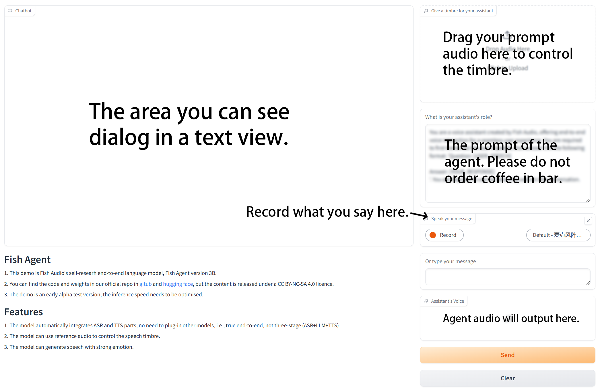

# Start Agent

## Requirements

- GPU memory: At least 8GB(under quanization), 16GB or more is recommanded.
- Disk usage: 10GB

## Download Model

You can get the model by:

```bash
huggingface-cli download fishaudio/fish-agent-v0.1-3b --local-dir checkpoints/fish-agent-v0.1-3b
```

Put them in the 'checkpoints' folder.

You also need the fish-speech model which you can download instructed by [inference](inference.md).

So there will be 2 folder in the checkpoints.

The `checkpoints/fish-speech-1.4` and `checkpoints/fish-agent-v0.1-3b`

## Environment Prepare

If you already have Fish-speech, you can directly use by adding the follow instruction:
```bash
pip install cachetools
```

!!! note
    Please use the Python version below 3.12 for compile.

If you don't have, please use the below commands to build your environment:

```bash
sudo apt-get install portaudio19-dev

pip install -e .[stable]
```

## Launch The Agent Demo.

To build fish-agent, please use the command below under the main folder:

```bash
python -m tools.api_server --llama-checkpoint-path checkpoints/fish-agent-v0.1-3b/ --mode agent --compile
```

The `--compile` args only support Python < 3.12 , which will greatly speed up the token generation.

It won't compile at once (remember).

Then open another terminal and use the command:

```bash
python -m tools.e2e_webui
```

This will create a Gradio WebUI on the device.

When you first use the model, it will come to compile (if the `--compile` is True) for a short time, so please wait with patience.

## Gradio Webui
<p align="center">
   
</p>

Have a good time!

## Performance

Under our test, a 4060 laptop just barely runs, but is very stretched, which is only about 8 tokens/s. The 4090 is around 95 tokens/s under compile, which is what we recommend.

# About Agent

The demo is an early alpha test version, the inference speed needs to be optimised, and there are a lot of bugs waiting to be fixed. If you've found a bug or want to fix it, we'd be very happy to receive an issue or a pull request.
