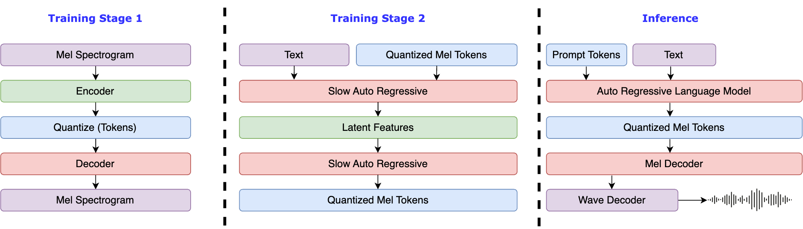
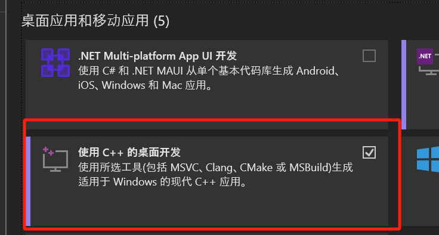

# Fish Speech の紹介

<div>
<a target="_blank" href="https://discord.gg/Es5qTB9BcN">

</a>
<a target="_blank" href="http://qm.qq.com/cgi-bin/qm/qr?_wv=1027&k=jCKlUP7QgSm9kh95UlBoYv6s1I-Apl1M&authKey=xI5ttVAp3do68IpEYEalwXSYZFdfxZSkah%2BctF5FIMyN2NqAa003vFtLqJyAVRfF&noverify=0&group_code=593946093">

</a>
<a target="_blank" href="https://hub.docker.com/r/fishaudio/fish-speech">

</a>
</div>

!!! warning
    私たちは、コードベースの違法な使用について一切の責任を負いません。お住まいの地域の DMCA（デジタルミレニアム著作権法）およびその他の関連法を参照してください。 <br/>
    このコードベースとモデルは、CC-BY-NC-SA-4.0 ライセンス下でリリースされています。

<p align="center">
   
</p>

## 要件

- GPU メモリ: 4GB（推論用）、8GB（ファインチューニング用）
- システム: Linux、Windows

## Windows セットアップ

Window にて開発を行っている方へ: 本コードベースを実行するのに WSL2 または Docker を利用することができます。

あまり詳しくない人は、Linux 環境なしでコードベースを実行するために以下の手順に従ってください。（モデルコンパイル機能`torch.compile`を利用できます。）：

<ol>
   <li>プロジェクトの圧縮ファイルをダウンロードし、展開</li>
   <li><code>install_env.bat</code>を開いて実行に必要な環境を整えます。
      <ul>
            <li><code>install_env.bat</code>の<code>USE_MIRROR</code>ミラーサイトを使用する場合、項目を編集してください。</li>
            <li><code>USE_MIRROR=false</code>は、最新の安定版の<code>torch</code>をオリジナルサイトからダウンロードします。<code>USE_MIRROR=true</code>は、最新の<code>torch</code>をミラーサイトからダウンロードします。デフォルトは<code>true</code>です。</li>
            <li><code>install_env.bat</code>の<code>INSTALL_TYPE</code>を編集して、コンパイル環境をダウンロードするかを設定できます。</li>
            <li><code>INSTALL_TYPE=preview</code>は、コンパイル環境付きのプレビュー版をダウンロードします。<code>INSTALL_TYPE=stable</code>は、コンパイル環境なしの安定版をダウンロードします。</li>
      </ul>
   </li>
   <li>ステップ2で<code>USE_MIRROR=preview</code>の場合、オプション、コンパイルモデル環境を有効にするたに以下のステップを実行してください。：
      <ol>
            <li>以下のリンクからLLVMコンパイラをダウンロードします：
               <ul>
                  <li><a href="https://huggingface.co/fishaudio/fish-speech-1/resolve/main/LLVM-17.0.6-win64.exe?download=true">LLVM-17.0.6（オリジナルサイト）</a></li>
                  <li><a href="https://hf-mirror.com/fishaudio/fish-speech-1/resolve/main/LLVM-17.0.6-win64.exe?download=true">LLVM-17.0.6（ミラーサイト）</a></li>
                  <li><code>LLVM-17.0.6-win64.exe</code>をダウンロードした後、ダブルクリックしてインストールし、適当な場所にインストールしてください。必ず<code>Add Path to Current User</code>をチェックして環境変数に追加することです。</li>
                  <li>インストールが完了したことを確認してください。</li>
               </ul>
            </li>
            <li>Microsoft Visual C++ 再頒布可能パッケージをダウンロードしてインストールし、dllの欠落問題を解決します。
               <ul>
                  <li><a href="https://aka.ms/vs/17/release/vc_redist.x64.exe">MSVC++ 14.40.33810.0 ダウンロード</a></li>
               </ul>
            </li>
            <li>Visual Studio Community Editionをダウンロードしてインストールし、MSVC++ビルドツールを取得し、LLVMのヘッダーファイル依存関係を解決します。
               <ul>
                  <li><a href="https://visualstudio.microsoft.com/zh-hans/downloads/">Visual Studio ダウンロード</a></li>
                  <li>Visual Studio Installerをインストールした後、Visual Studio Community 2022をダウンロードします。</li>
                  <li>以下のスクリーンショットのように<code>Modify</code>ボタンをクリックし、<code>Desktop development with C++</code>オプションにチェックをつけてダウンロードします。</li>
                  <p align="center">
                     
                  </p>
               </ul>
            </li>
            <li>インストール <a href="https://developer.nvidia.com/cuda-12-1-0-download-archive?target_os=Windows&target_arch=x86_64">CUDA Toolkit 12</a></li>
      </ol>
   </li>
   <li><code>start.bat</code>を実行し、Fish-Speechのトレーニング/推論設定WebUIを開いてください。。
      <ul>
            <li>（オプション）直接推論ページに行きたい場合は、プロジェクトルートディレクトリの<code>API_FLAGS.txt</code>の最初の3行を次のように変更してください：
               <pre><code>--infer
# --api
# --listen ...
...</code></pre>
            </li>
            <li>（オプション）APIサーバーを起動したい場合は、プロジェクトルートディレクトリの<code>API_FLAGS.txt</code>の最初の3行を次のように変更してください：
               <pre><code># --infer
--api
--listen ...
...</code></pre>
            </li>
      </ul>
   </li>
   <li>（オプション）<code>run_cmd.bat</code>をダブルクリックして、このプロジェクトの仮想環境を有効化できます。</li>
</ol>

## Linux セットアップ

```bash
# python 3.10の仮想環境を作成します。virtualenvも使用できます。
conda create -n fish-speech python=3.10
conda activate fish-speech

# pytorchをインストールします。
pip3 install torch torchvision torchaudio

# fish-speechをインストールします。
pip3 install -e .[stable]

# (Ubuntu / Debianユーザー) sox + ffmpegをインストールします。
apt install libsox-dev ffmpeg
```

## Docker セットアップ

1. NVIDIA Container Toolkit のインストール：

    Docker で GPU を使用してモデルのトレーニングと推論を行うには、NVIDIA Container Toolkit をインストールする必要があります：

    Ubuntu ユーザーの場合：

    ```bash
    # リポジトリの追加
    curl -fsSL https://nvidia.github.io/libnvidia-container/gpgkey | sudo gpg --dearmor -o /usr/share/keyrings/nvidia-container-toolkit-keyring.gpg \
        && curl -s -L https://nvidia.github.io/libnvidia-container/stable/deb/nvidia-container-toolkit.list | \
            sed 's#deb https://#deb [signed-by=/usr/share/keyrings/nvidia-container-toolkit-keyring.gpg] https://#g' | \
            sudo tee /etc/apt/sources.list.d/nvidia-container-toolkit.list
    # nvidia-container-toolkit のインストール
    sudo apt-get update
    sudo apt-get install -y nvidia-container-toolkit
    # Docker サービスの再起動
    sudo systemctl restart docker
    ```

    他の Linux ディストリビューションを使用している場合は、以下のインストールガイドを参照してください：[NVIDIA Container Toolkit Install-guide](https://docs.nvidia.com/datacenter/cloud-native/container-toolkit/latest/install-guide.html)。

2. fish-speech イメージのプルと実行

    ```shell
    # イメージのプル
    docker pull fishaudio/fish-speech:latest-dev
    # イメージの実行
    docker run -it \
        --name fish-speech \
        --gpus all \
        -p 7860:7860 \
        fishaudio/fish-speech:latest-dev \
        zsh
    # 他のポートを使用する場合は、-p パラメータを YourPort:7860 に変更してください
    ```

3. モデルの依存関係のダウンロード

    Docker コンテナ内のターミナルにいることを確認し、huggingface リポジトリから必要な `vqgan` と `llama` モデルをダウンロードします。

    ```bash
    huggingface-cli download fishaudio/fish-speech-1.4 --local-dir checkpoints/fish-speech-1.4
    ```

4. 環境変数の設定と WebUI へのアクセス

    Docker コンテナ内のターミナルで、`export GRADIO_SERVER_NAME="0.0.0.0"` と入力して、外部から Docker 内の gradio サービスにアクセスできるようにします。
    次に、Docker コンテナ内のターミナルで `python tools/webui.py` と入力して WebUI サービスを起動します。

    WSL または MacOS の場合は、[http://localhost:7860](http://localhost:7860) にアクセスして WebUI インターフェースを開くことができます。

    サーバーにデプロイしている場合は、localhost をサーバーの IP に置き換えてください。

## 変更履歴

- 2024/09/10: Fish-Speech を Ver.1.4 に更新し、データセットのサイズを増加させ、quantizer n_groups を 4 から 8 に変更しました。
- 2024/07/02: Fish-Speech を Ver.1.2 に更新し、VITS デコーダーを削除し、ゼロショット能力を大幅に強化しました。
- 2024/05/10: Fish-Speech を Ver.1.1 に更新し、VITS デコーダーを実装して WER を減少させ、音色の類似性を向上させました。
- 2024/04/22: Fish-Speech Ver.1.0 を完成させ、VQGAN および LLAMA モデルを大幅に修正しました。
- 2023/12/28: `lora`微調整サポートを追加しました。
- 2023/12/27: `gradient checkpointing`、`causual sampling`、および`flash-attn`サポートを追加しました。
- 2023/12/19: webui および HTTP API を更新しました。
- 2023/12/18: 微調整ドキュメントおよび関連例を更新しました。
- 2023/12/17: `text2semantic`モデルを更新し、自由音素モードをサポートしました。
- 2023/12/13: ベータ版をリリースし、VQGAN モデルおよび LLAMA に基づく言語モデル（音素のみサポート）を含みます。

## 謝辞

- [VITS2 (daniilrobnikov)](https://github.com/daniilrobnikov/vits2)
- [Bert-VITS2](https://github.com/fishaudio/Bert-VITS2)
- [GPT VITS](https://github.com/innnky/gpt-vits)
- [MQTTS](https://github.com/b04901014/MQTTS)
- [GPT Fast](https://github.com/pytorch-labs/gpt-fast)
- [Transformers](https://github.com/huggingface/transformers)
- [GPT-SoVITS](https://github.com/RVC-Boss/GPT-SoVITS)
