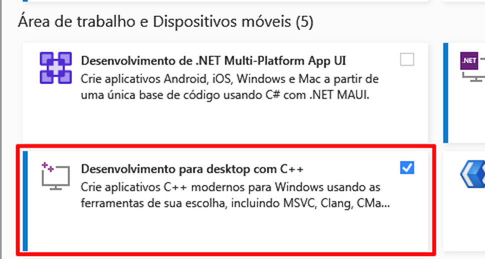

# Introdução

<div>
<a target="_blank" href="https://discord.gg/Es5qTB9BcN">

</a>
<a target="_blank" href="http://qm.qq.com/cgi-bin/qm/qr?_wv=1027&k=jCKlUP7QgSm9kh95UlBoYv6s1I-Apl1M&authKey=xI5ttVAp3do68IpEYEalwXSYZFdfxZSkah%2BctF5FIMyN2NqAa003vFtLqJyAVRfF&noverify=0&group_code=593946093">

</a>
<a target="_blank" href="https://hub.docker.com/r/lengyue233/fish-speech">

</a>
</div>

!!! warning
    Não nos responsabilizamos por qualquer uso ilegal do código-fonte. Consulte as leis locais sobre DMCA (Digital Millennium Copyright Act) e outras leis relevantes em sua região. <br/>
    Este repositório de código e os modelos são distribuídos sob a licença CC-BY-NC-SA-4.0.

<p align="center">
   
</p>

## Requisitos

- Memória da GPU: 4GB (para inferência), 8GB (para ajuste fino)
- Sistema: Linux, Windows

## Configuração para Windows

No Windows, usuários avançados podem considerar usar o WSL2 ou Docker para executar o código.

Para Usuários comuns (não-avançados), siga os métodos abaixo para executar o código sem um ambiente Linux (incluindo suporte para `torch.compile`):

<ol>
   <li>Extraia o arquivo compactado do projeto.</li>
   <li>Prepare o ambiente conda:
    <ul>
      <li>Abra o <code>install_env.bat</code> para baixar e iniciar a instalação do miniconda.</li>
      <li>Personalize o download (opcional):
        <ul>
          <li>**Site espelho:** Para usar um site espelho para downloads mais rápidos, defina <code>USE_MIRROR=true</code> no <code>install_env.bat</code> (padrão). Caso contrário, use <code>USE_MIRROR=false</code>.</li>
          <li>**Ambiente compilado:** Para baixar a versão de prévia com o ambiente compilado, defina <code>INSTALL_TYPE=preview</code>. Para a versão estável sem ambiente compilado, use <code>INSTALL_TYPE=stable</code>.</li>
        </ul>
      </li>
      </ul>
   </li>
   <li>Se você escolheu a versão de prévia com ambiente compilado (<code>INSTALL_TYPE=preview</code>), siga para a próxima etapa (opcional):
      <ol>
            <li>Baixe o compilador LLVM usando os seguintes links:
               <ul>
                  <li><a href="https://huggingface.co/fishaudio/fish-speech-1/resolve/main/LLVM-17.0.6-win64.exe?download=true">LLVM-17.0.6 (download do site original)</a></li>
                  <li><a href="https://hf-mirror.com/fishaudio/fish-speech-1/resolve/main/LLVM-17.0.6-win64.exe?download=true">LLVM-17.0.6 (download do site espelho)</a></li>
                  <li>Após baixar o <code>LLVM-17.0.6-win64.exe</code>, clique duas vezes para instalá-lo, escolha um local de instalação apropriado. E durante a instalação, marque a opção <code>Add Path to Current User</code> para adicionar às variáveis de ambiente.</li>
                  <li>Confirme se a instalação foi concluída.</li>
               </ul>
            </li>
            <li>Baixe e instale o pacote Microsoft Visual C++ Redistributable para resolver possíveis problemas de .dll ausentes.
               <ul>
                  <li><a href="https://aka.ms/vs/17/release/vc_redist.x64.exe">Download do MSVC++ 14.40.33810.0</a></li>
               </ul>
            </li>
            <li>Baixe e instale o Visual Studio Community Edition para obter as ferramentas de compilação MSVC++, resolvendo as dependências do arquivo de cabeçalho LLVM.
               <ul>
                  <li><a href="https://visualstudio.microsoft.com/pt-br/downloads/">Download do Visual Studio</a></li>
                  <li>Após instalar o Visual Studio Installer, baixe o Visual Studio Community 2022.</li>
                  <li>Clique no botão <code>Modificar</code>, conforme mostrado abaixo, encontre a opção <code>Desenvolvimento para desktop com C++</code> e marque-a para download.</li>
                  <p align="center">
                     
                  </p>
               </ul>
            </li>
            <li>Instale o <a href="https://developer.nvidia.com/cuda-12-1-0-download-archive?target_os=Windows&target_arch=x86_64">CUDA Toolkit 12</a></li>
      </ol>
   </li>
   <li>Clique duas vezes em <code>start.bat</code> para entrar na página da WebUI de configuração de inferência de treinamento do Fish-Speech.
      <ul>
            <li>(Opcional) Se desejar ir direto para a página de inferência, edite o arquivo <code>API_FLAGS.txt</code> no diretório raiz do projeto e modifique as três primeiras linhas da seguinte forma:
               <pre><code>--infer
# --api
# --listen ...
...</code></pre>
            </li>
            <li>(Opcional) Se preferir iniciar o servidor da API, edite o arquivo <code>API_FLAGS.txt</code> no diretório raiz do projeto e modifique as três primeiras linhas da seguinte forma:
               <pre><code># --infer
--api
--listen ...
...</code></pre>
            </li>
      </ul>
   </li>
   <li>(Opcional) Clique duas vezes em <code>run_cmd.bat</code> para entrar na CLI do conda/python deste projeto.</li>
</ol>

## Configuração para Linux

```bash
# Crie um ambiente virtual python 3.10, você também pode usar virtualenv
conda create -n fish-speech python=3.10
conda activate fish-speech

# Instale o pytorch
pip3 install torch torchvision torchaudio

# Instale o fish-speech
pip3 install -e .[stable]

# Para os Usuário do Ubuntu / Debian: Instale o sox
apt install libsox-dev
```

## Histórico de Alterações

- 02/07/2024: Fish-Speech atualizado para a versão 1.2, removido o Decodificador VITS e aprimorado consideravelmente a capacidade de zero-shot.
- 10/05/2024: Fish-Speech atualizado para a versão 1.1, implementado o decodificador VITS para reduzir a WER e melhorar a similaridade de timbre.
- 22/04/2024: Finalizada a versão 1.0 do Fish-Speech, modificados significativamente os modelos VQGAN e LLAMA.
- 28/12/2023: Adicionado suporte para ajuste fino `lora`.
- 27/12/2023: Adicionado suporte para `gradient checkpointing`, `causual sampling` e `flash-attn`.
- 19/12/2023: Atualizada a interface web e a API HTTP.
- 18/12/2023: Atualizada a documentação de ajuste fino e exemplos relacionados.
- 17/12/2023: Atualizado o modelo `text2semantic`, suportando o modo sem fonemas.
- 13/12/2023: Versão beta lançada, incluindo o modelo VQGAN e um modelo de linguagem baseado em LLAMA (suporte apenas a fonemas).

## Agradecimentos

- [VITS2 (daniilrobnikov)](https://github.com/daniilrobnikov/vits2)
- [Bert-VITS2](https://github.com/fishaudio/Bert-VITS2)
- [GPT VITS](https://github.com/innnky/gpt-vits)
- [MQTTS](https://github.com/b04901014/MQTTS)
- [GPT Fast](https://github.com/pytorch-labs/gpt-fast)
- [Transformers](https://github.com/huggingface/transformers)
- [GPT-SoVITS](https://github.com/RVC-Boss/GPT-SoVITS)
