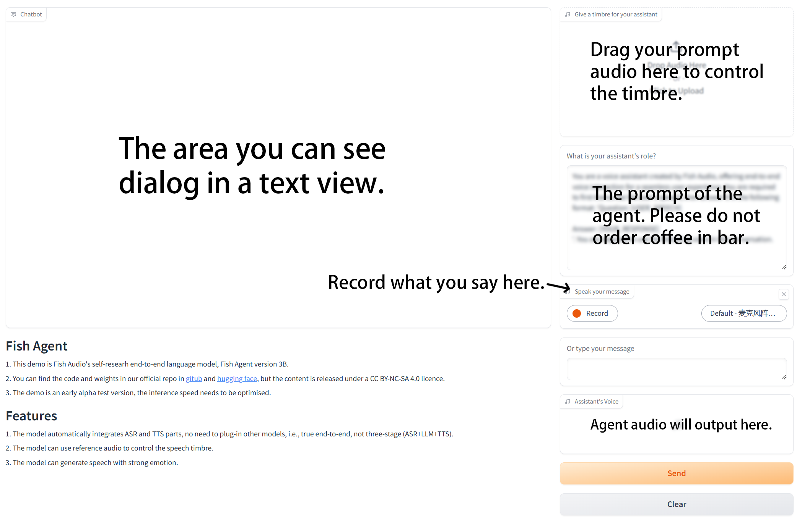

# 启动 Agent

## 要求

- GPU 显存: 至少 8GB（在量化的条件下），推荐 16GB 及以上
- 硬盘使用量: 10GB

## 下载模型

你可以执行下面的语句来获取模型:

```bash
huggingface-cli download fishaudio/fish-agent-v0.1-3b --local-dir checkpoints/fish-agent-v0.1-3b
```

如果你处于国内网络，首先执行:

```bash
export HF_ENDPOINT=https://hf-mirror.com
```

把他们放进名为 'checkpoints' 的文件夹内。

你同样需要 fish-speech 的模型，关于如何获取 fish-speech 模型请查看[inference](inference.md)。

完成后你的 checkpoints 文件夹中会有两个子文件夹：`checkpoints/fish-speech-1.4` 和 `checkpoints/fish-agent-v0.1-3b`。

## Environment Prepare

如果你已经有了 Fish-Speech 环境，你可以在安装下面的包的前提下直接使用：

```bash
pip install cachetools
```

!!! note
请使用小于 3.12 的 python 版本使 compile 可用

如果你没有 Fish-Speech 环境，请执行下面的语句来构造你的环境：

```bash
sudo apt-get install portaudio19-dev

pip install -e .[stable]
```

## 链接 Agent.

你需要使用以下指令来构建 fish-agent

```bash
python -m tools.api_server --llama-checkpoint-path checkpoints/fish-agent-v0.1-3b/ --mode agent --compile
```

`--compile`只能在小于 3.12 版本的 Python 使用，这个功能可以极大程度上提高生成速度。

你需要哦注意 compile 需要进行一段时间.

然后启动另一个终端并执行:

```bash
python -m tools.e2e_webui
```

这会在设备上创建一个 Gradio WebUI。

每当进行第一轮对话的时候，模型需要 compile 一段时间，请耐心等待

## Gradio Webui

<p align="center">
   
</p>

玩得开心！

## Performance

在我们的测试环境下， 4060 laptop GPU 只能刚刚运行该模型，只有大概 8 tokens/s。 4090 GPU 可以在编译后达到 95 tokens/s，我们推荐使用至少 4080 以上级别的 GPU 来达到较好体验。

# About Agent

该模型仍处于测试阶段。如果你发现了问题，请给我们提 issue 或者 pull request，我们非常感谢。
